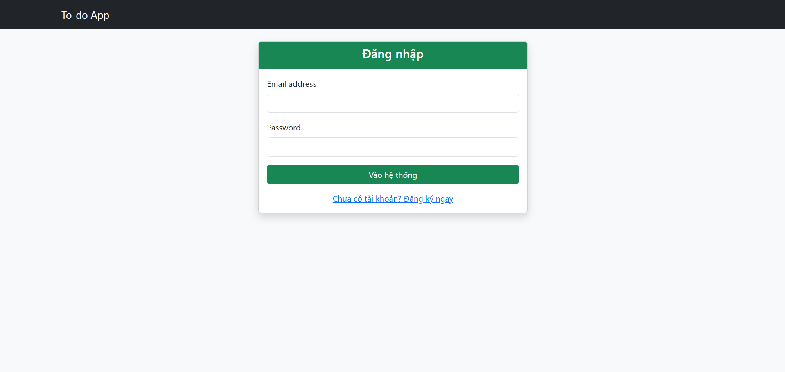
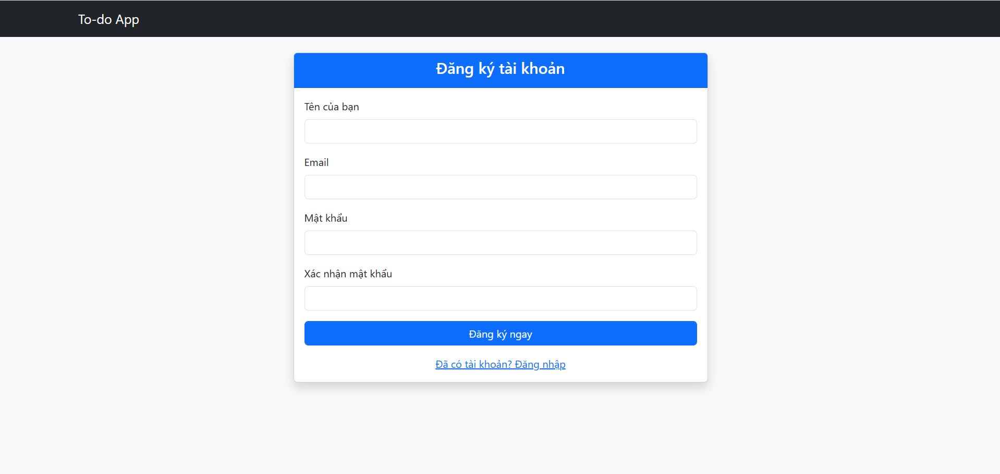
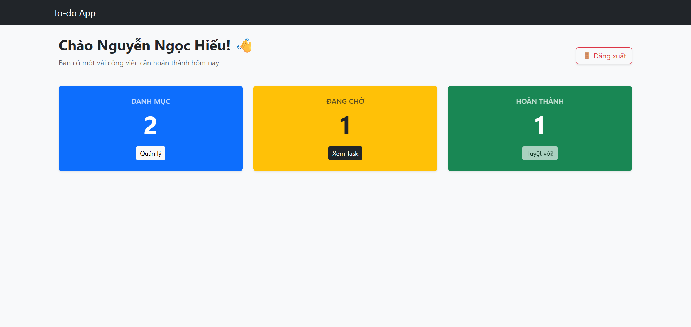
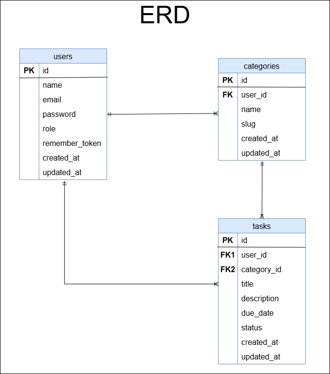
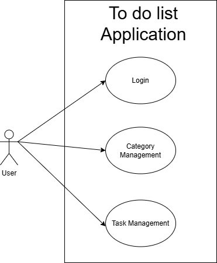

# 🚀 Laravel Task Management System

A clean and scalable **Task Management System** built with **Laravel 10**, applying modern architecture patterns like **Repository Pattern** and **Observers**.

---

## 📌 Tech Stack

| Technology | Description |
|----------|------------|
| ⚙️ Laravel 12 | Backend Framework |
| 🐬 MySQL | Database |
| 🧩 Repository Pattern | Business logic separation |
| 👀 Observers | Auto-handling model events |
| 🎨 Bootstrap 5 | UI Framework |

---

## 🌟 Key Features

- 👤 **Authentication**
  - Register & Login system
  - Secure session handling

- 📁 **Category Management**
  - Create, update, delete categories
  - Each user manages their own data

- ✅ **Task Management**
  - Full CRUD operations
  - Assign tasks to categories
  - Toggle status (Pending ↔ Completed)

- 📊 **Dashboard**
  - Display all tasks
  - Sorted by latest updates

- 🔒 **Security**
  - Middleware protection
  - User-based data isolation

---

## 🎨 Application Screenshots

### Login
<p align="center">
  
</p>

### Signup
<p align="center">
  
</p>

### Dashboard
<p align="center">
  
</p>

### Category Feature UI
<p align="center">
  
</p>

### Task Feature UI
<p align="center">
  
</p>

---

## 🧠 System Design

### 📌 ERD Diagram



**Explanation:**

- A **User** has many **Categories**
- A **User** has many **Tasks**
- A **Category** has many **Tasks**

👉 Ensures data is properly scoped per user and maintains relational integrity.

---

### 🎯 Use Case Diagram



**Main Features:**

- Login, Signup, Logout
- Manage categories (CRUD)
- Manage tasks (CRUD)
- View dashboard and task overview

---

## 📍 Main Routes

| Method | URI | Description |
|------|-----|------------|
| GET | /login | Show login page |
| POST | /login | Handle login |
| GET | /register | Show register page |
| POST | /register | Handle registration |
| POST | /logout | Logout user |
| GET | /dashboard | Dashboard |
| GET | /categories | List categories |
| POST | /categories | Create category |
| DELETE | /categories/{id} | Delete category |
| GET | /tasks | List tasks |
| POST | /tasks | Create task |
| GET | /tasks/{id}/edit | Edit task |
| PUT/PATCH | /tasks/{id} | Update task |
| DELETE | /tasks/{id} | Delete task |
| PATCH | /tasks/{id}/toggle | Toggle status |

---

## 🛠️ Installation

### 1. Clone repository

```bash
git clone https://github.com/your-username/laravel-task-management.git
cd laravel-task-management
```

### 2. Install dependencies
```bash
composer install
```

### 3. Setup environment
```bash
cp .env.example .env
php artisan key:generate
```

### 4. Configure database
```bash
DB_DATABASE=your_db_name
DB_USERNAME=root
DB_PASSWORD=
```

### 5. Run migrations
```bash
php artisan migrate
```

### 6. Run application
```bash
php artisan serve
```

👉 Open: http://127.0.0.1:8000

## 🏗️ Architecture

- 📦 **Repository Pattern** – Separate logic from controllers  
- 👀 **Observers** – Auto assign `user_id`, generate `slug`  
- 🧬 **Eloquent Relationships** – User → Categories → Tasks  
